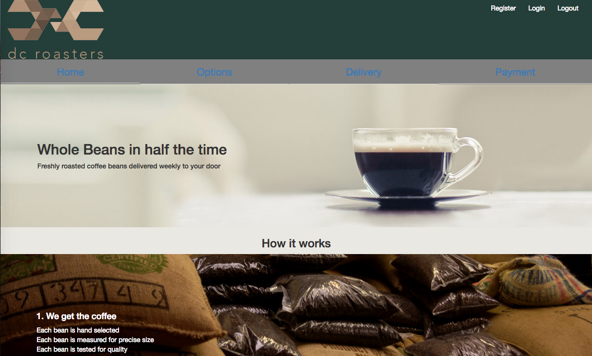
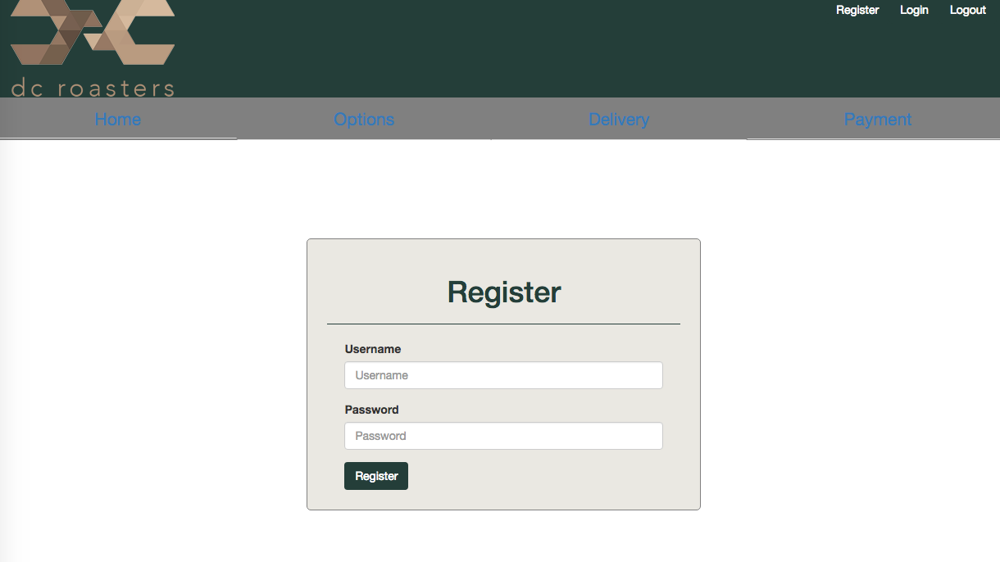
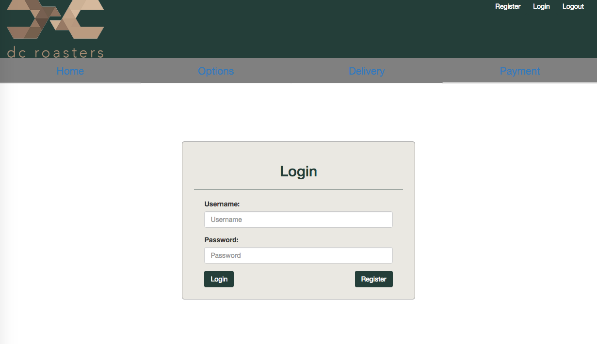
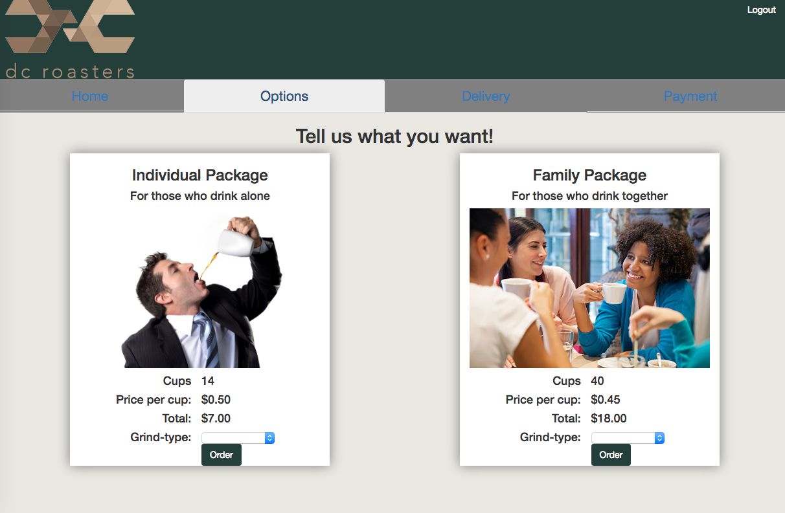
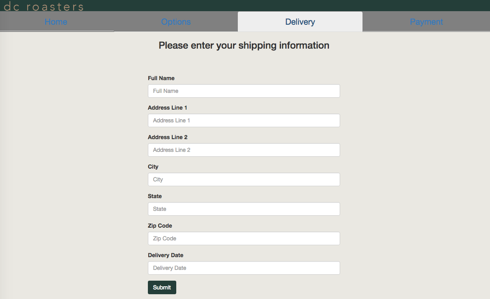
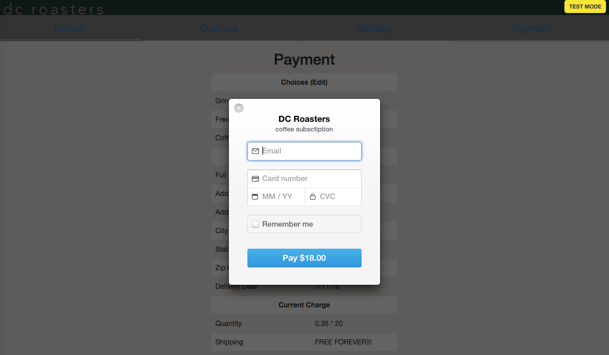

# Coffee app

###Overview of Project
This is an E-commerce coffee subscription website built using the MEAN stack. The backend was built first to practice writing an API. The user must register before logging in and must login before ordering. Each user and order information is save to a MongoDB database.

##Technologies Used
* Bootstrap
* HTML5
* CSS3
* Angular.js
* Node.js
* JavaScript
* Stripe Card processing
* MongoDB
* Express.js

###Contributors
* Backend built by DeeAnn Kendrick and Shanda Kennedy
* Frontend built by DeeAnn Kendrick and Regan Co

##URL to Live Project
[Check it out here](http://kendrickdcroasters.surge.sh/#/home)

##Screen Shots

